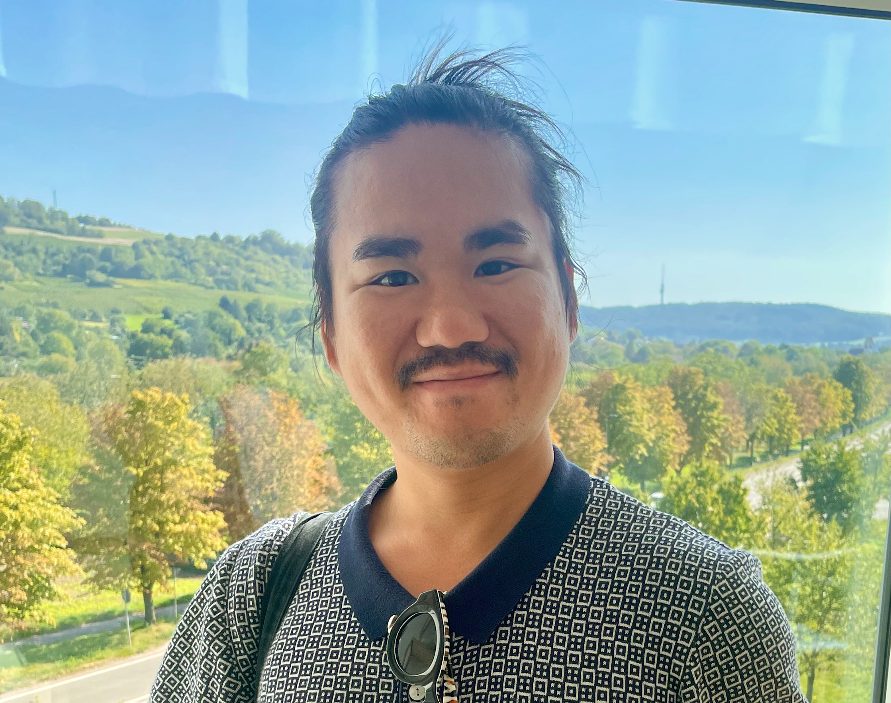
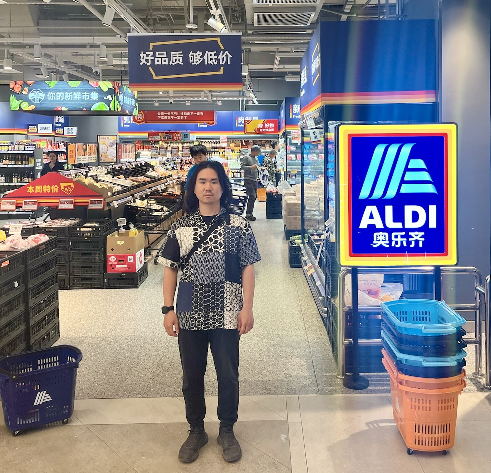
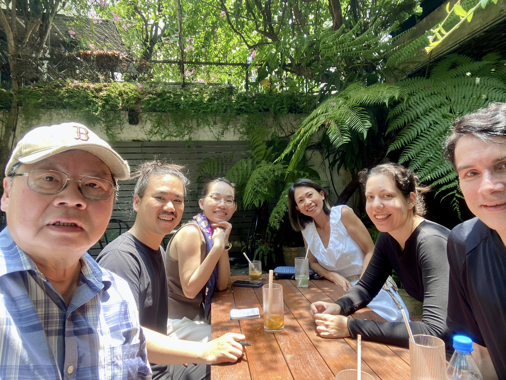
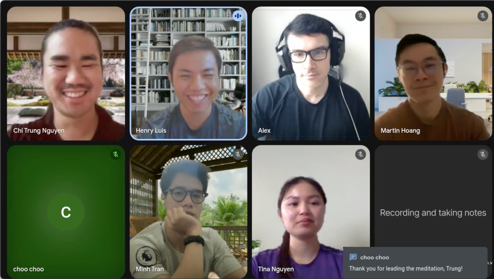
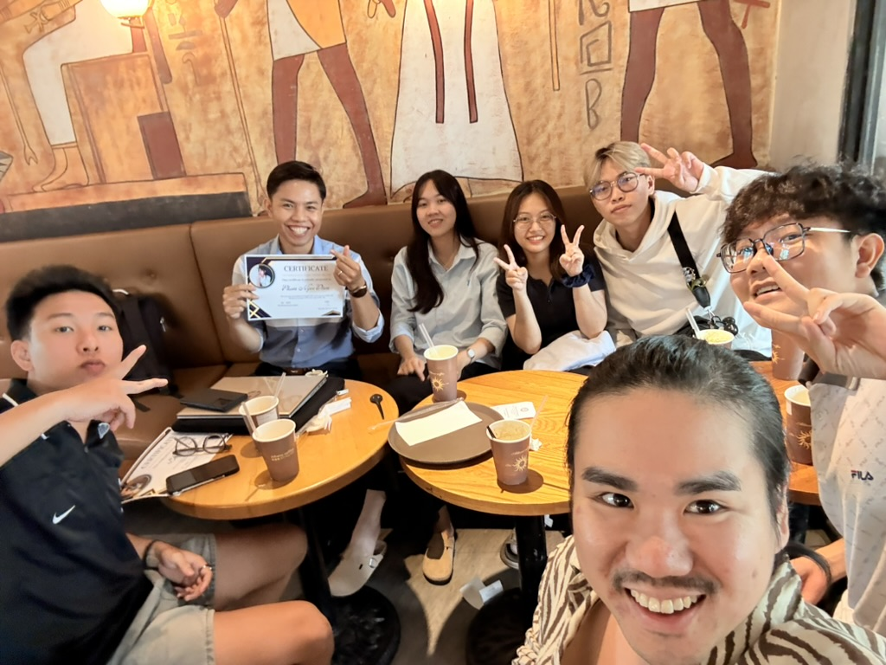
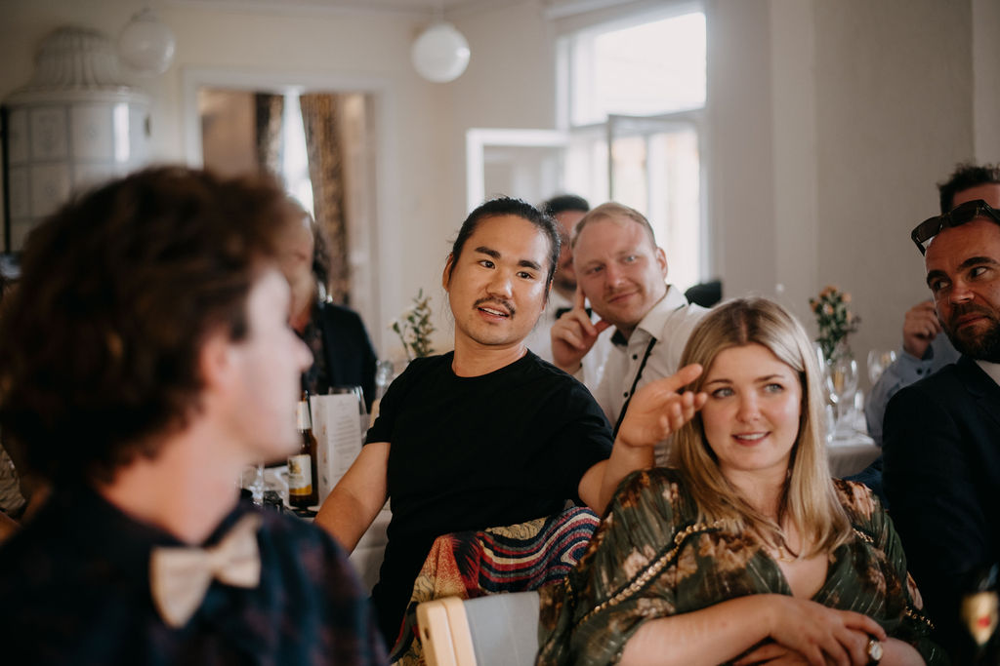

# Founder Bottleneck Diagnostician

I'm Trung Nguyen. I find the constraint founders are already scaling around instead of fixing. 90 minutes, one session — for capable founders compensating for a blind spot instead of resolving it.

[The Founder Bottleneck Diagnostic](/founder-diagnostic)

[Who is Trung Nguyen? →](/about)

## My Story

I'm Trung. A Vietnamese-German builder obsessed with turning chaos into clarity — across startups, communities, and human systems. I design technical foundations and mindsets strong enough to grow through anything.

After leading engineering teams and carving my own path through freelancing and venture-building, I learned something simple: Transformation doesn't happen through transactions — it happens when people bet on each other.

Today I run Founder Bottleneck Diagnostics: 90 minutes to find and name the constraint behind stalled decisions, execution and growth. I still write about the founder's internal state, because it distorts business diagnosis — but the commercial work is structural, not therapy and not ongoing coaching.

## The Innernet

Sustainable High Performance

### A Calm, High-Clarity Community for Sustainable Growth

A space for leaders, operators, and emerging talent who want to grow from the inside out. We help you build sustainable high performance through guided reflection, emotional clarity, and shared wisdom.

Inner work for outer impact.

#### Spaciousness > Pressure

High standards without hardness. A space that feels like exhaling.

#### Clarity > Hacks

Focus on the inner loops that power everything.

#### Connection > Content

Depth without heaviness. Growth without noise.

#### Character > Skills

Philosophy-backed personal evolution.

[Join Weekly Reflection](https://lu.ma/calendar/cal-Ba6Y0gdYqYZqdIP)

[Learn More](/the-innernet)

## Mission & Vision

### Vision

A global, high-trust ecosystem where founders, creatives, and visionaries embrace unlimited curiosity, practice fearless authenticity, demonstrate radical resilience, and foster kindness in community.

### Mission

To create presence-focused experiences that foster genuine human connection, collaboration, and personal growth—while amplifying unheard voices and funding impactful businesses.

"Build slow, build strong, build for impact. Focus on presence today, for a future worth living."

## How I Help

### Founder Bottleneck Diagnostic

A 90-minute diagnostic for bootstrapped founders who sense something structural is off. One session. One verdict. No dependency.

- → Decision, execution & trust load analysis
- → Clear verdict you can act on alone
[Learn more](/founder-diagnostic)

### The Innernet

A calm, high-clarity community for leaders and emerging talent who want sustainable high performance. Inner work for outer impact.

- → Weekly reflection sessions
- → Emotional clarity & mental reset
- → Global community of aligned minds
[Learn more](/the-innernet)

[Essays](/essays)

[Case studies](/case-studies)

[Media appearances](/media)

## Trusted By

> "I think it's more about learning different ways to manage my own energy from others. There are so many valuable insights shared, and I want to apply these to both my professional and personal life."
Tina NguyenFounder & Workshop Participant

> "This applies to my personal life as well. Just try everything, A-B test everything, see what works. If it feels good for you, then do it. That's the mindset I'll be applying going forward in my life."
Minh TranFounder & Workshop Participant

> "I also like this group. I think it's always teaching me things. Like today, I definitely learned how to add more KPIs and make my life a little more organized, which was my goal."
Choo ChooFounder & Workshop Participant

## Books That Shaped Me

These works have profoundly influenced my thinking and approach to technology, leadership, and personal growth. They might transform your perspective too.

### Mastery

by Robert Greene

Robert Greene's deep dive into the path to mastery, showing how dedication, patience, and strategic practice lead to exceptional achievement. This book has transformed how I approach personal growth and leadership development.

[Get the book](https://www.amazon.com/s?k=Mastery%20Robert%20Greene)

### Get Together

by Bailey Richardson, Kevin Huynh, Kai Elmer Sotto

A practical guide to building communities that matter. This book has been instrumental in shaping my approach to creating meaningful connections and building the Innernet community.

[Get the book](https://www.amazon.com/s?k=Get%20Together%20Bailey%20Richardson%2C%20Kevin%20Huynh%2C%20Kai%20Elmer%20Sotto)

### The Creative Act

by Rick Rubin

Rick Rubin's profound exploration of creativity as a spiritual practice. This book has deepened my understanding of presence, authenticity, and the creative process in both business and personal growth.

[Get the book](https://www.amazon.com/s?k=The%20Creative%20Act%20Rick%20Rubin)

### Wherever You Go, There You Are

by Jon Kabat-Zinn

Jon Kabat-Zinn's classic on mindfulness meditation. This book has been foundational in my approach to cultivating presence and awareness in daily life and coaching practice.

[Get the book](https://www.amazon.com/s?k=Wherever%20You%20Go%2C%20There%20You%20Are%20Jon%20Kabat-Zinn)

### Mindset

by Carol S. Dweck

Carol Dweck's groundbreaking work on the power of our beliefs. This book has been essential in my coaching approach, helping founders overcome limiting patterns and embrace growth.

[Get the book](https://www.amazon.com/s?k=Mindset%20Carol%20S.%20Dweck)

## Newsletter

Join founders and leaders who receive my weekly insights on growth, technology, and embracing discomfort as a catalyst for transformation.

Latest Episode

### Opening Your Inner Door: The Power of Being Real

Episode 16 • 9 min

### Weekly Newsletter

Get actionable insights on building resilient systems and teams, delivered directly to your inbox.

[Subscribe](https://theuncomfortzone.substack.com)Join today. No spam, unsubscribe anytime.

[Explore all episodes](https://theuncomfortzone.substack.com)

## Let's Connect

I work with founders who are committed to building technology with purpose and integrity. If that's you, let's start a conversation.

The world needs more builders who care about the impact of what they create.

[Start the Conversation](https://cal.com/trungfromberlin/intro-call)

---
Source: https://iamtrung.com/
